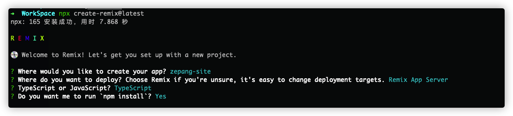
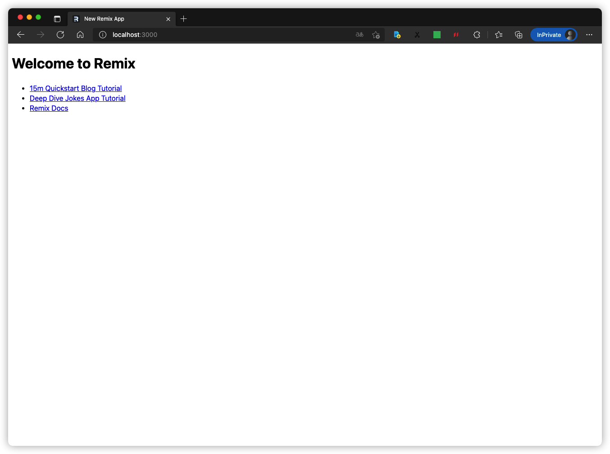
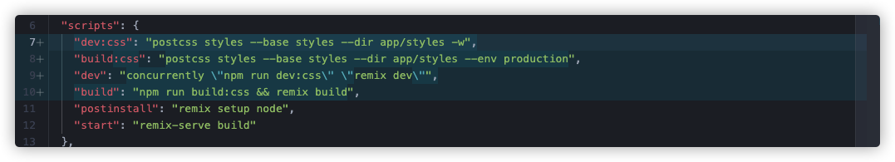
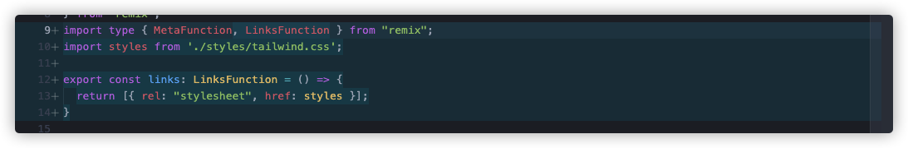
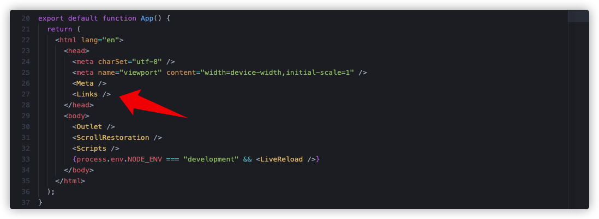
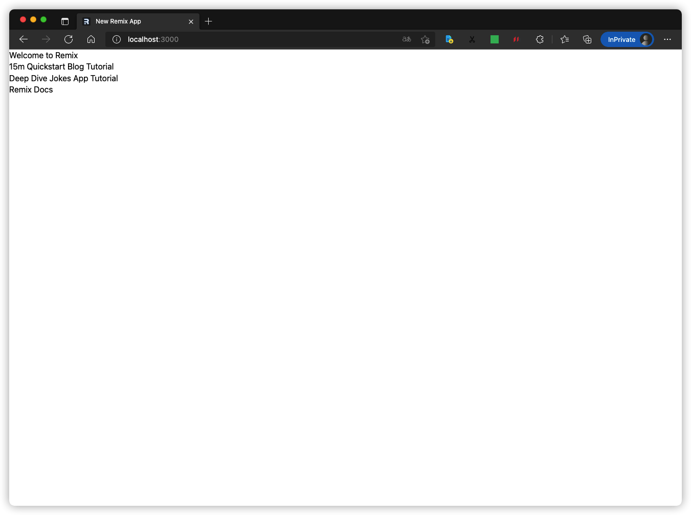
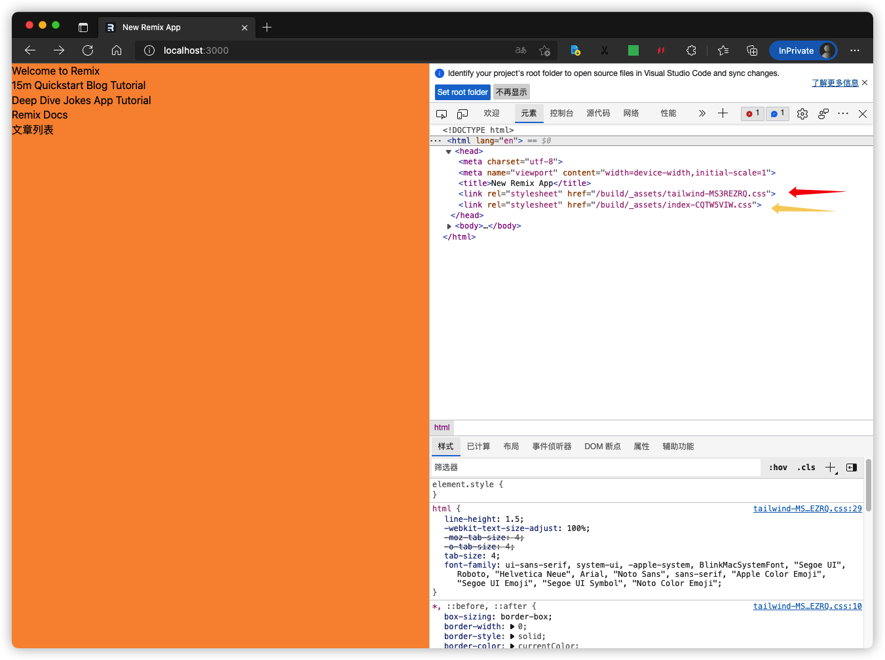
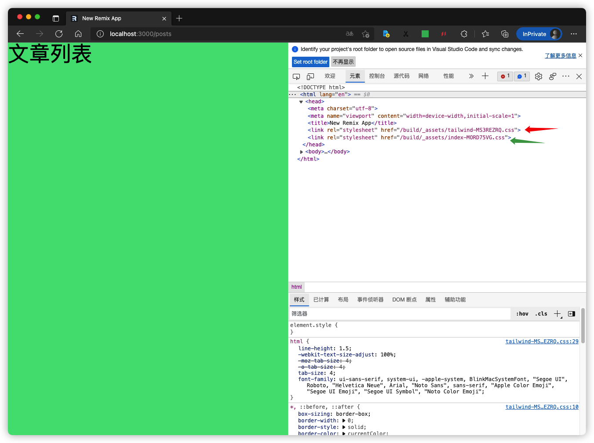

# Welcome to Remix!

- [Remix Docs](https://remix.run/docs)

这是我第一个尝试使用Remix开发的应用。所以，README.md可能会包含一些Remix基本的用法和概念等等这些在官方文档上也能找到的可能比较多余的内容，我只是习惯性的记录下自己将要学习的新东西，如果有人不喜欢，那么跳过就好了。

## let's go

```sh
# 创建新项目
npx create-remix@latest
```
选择如下：



## 目录结构

```sh
.
├── README.md
├── app
│   ├── entry.client.tsx
│   ├── entry.server.tsx
│   ├── root.tsx
│   └── routes
│       └── index.tsx
├── package-lock.json
├── package.json
├── public
│   └── favicon.ico
├── remix.config.js
├── remix.env.d.ts
└── tsconfig.json
```

主要的目录说明：

- `app/` 存放Remix 应用的代码，同等于 `vue-cli / create-react-app` 生成项目里面的 `src/` 目录
- `app/entry.client.tsx` 我们看下里边的代码：
  
  ```tsx
  import { hydrate } from "react-dom";
  import { RemixBrowser } from "remix";

  hydrate(<RemixBrowser />, document);
  ``` 
  - hydrate 是 React 中提供在初次渲染的时候，去复用原本已经存在的 DOM 节点，减少重新生成节点以及删除原本 DOM 节点的开销，来加速初次渲染的功能。简单来说就是服务端渲染的时候，服务端返回字符串，浏览器根据这些字符串进行 React 组件的创建，完成初始化的工作，这个过程叫“混合渲染”
  - 当应用在浏览器加载完成的时候会运行这个文件里面的 JavaScript 代码，Remix 用这份文件来 hydrate React 组件。
  
- app/entry.server.tsx 当一个请求发送到服务器的时候，这个文件里面的 JavaScript 代码会第一时间运行。Remix 会帮你加载所有必要的数据，而我们将会负责将响应的数据发送回浏览器
- app/root.tsx 这份文件是应用的根组件，就像 Vue 的 App.vue ，网页的 html 标签将会在这里渲染
- app/routes/ 这个路径下面将会存放所有和路由相关的模块文件，Remix 会根据这个目录下面的文件名字来创建对应的 URL 路由。
- public/ 这里和平常一样存放你项目里的静态资源，例如图片，字体等等
- remix.config.js Remix 应用对应的配置写在这个文件里面

尝试打包下文件

```sh
npm run build
```

多出几个目录：

- `.cache/` 这个文件夹里面的内容是 Remix 内部使用的东西
- `build/` 是服务端的代码
- `public/build/` 是客户端的代码

这几个目录路劲在创建项目的时候已经被添加进`.gitignore`文件中

运行打包后的应用：

```sh
npm run start
```



打开页面之后给我们推荐了三个链接，在我们需要的时候可以参考下

## tailwindcss和样式

这里我选择使用postcss预处理器来引入tailwindcss和处理自定义的样式

参考文档：

- https://remix.run/docs/en/v1/guides/styling#tailwind
- https://remix.run/docs/en/v1/guides/styling#postcss

详细的说明请看上述的文档吧，我简述下配置的过程。安装依赖如下：

```sh
npm add -D concurrently tailwindcss postcss-cli postcss autoprefixer postcss-import 
```

在根目录添加两个配置文件`postcss.config.js`，`tailwind.config.js`：

```js
// postcss.config.js
module.exports = {
  plugins: [
    require('postcss-import'),
    require('tailwindcss/nesting'),
    require('tailwindcss'),
    require('autoprefixer'),
  ]
}
```

```js
// tailwind.config.js
module.exports = {
  content: ['./app/**/*.{ts,tsx}'],
  theme: {
    extend: {},
  },
  plugins: [],
}

```

创建目录`styles`和文件`styles/tailwind.css`，修改`package.json`的命令如下：



运行命令：

```sh
npm run dev
```

新增目录文件：

```sh
app/styles
└── tailwind.css
```

在`app/root.tsx`中引入样式`tailwind.css`：



上述声明的 `links` 函数返回的配置，都会在 `<Links>` 组件部位引入到页面中。`app/root.tsx`文件中如下位置：



我们查看下样式生效后的页面，如下：



接着，我们创建文件`app/routes/posts/index.tsx`:

```tsx
import { LinksFunction } from 'remix';
import styles from '../../styles/routes/posts/index.css';

export const links: LinksFunction = () => {
  return [{ rel: "stylesheet", href: styles }]
}

export default function Post () {
  return (
    <h1 className="text-5xl">文章列表</h1>
  )
}
```

同时创建文件`styles/routes/index.css`，`styles/routes/posts/index.css`：

```css
/* styles/routes/index.css */
body {
  @apply bg-orange-400;
}
```

```css
/* styles/routes/posts/index.css */
body {
  @apply bg-green-400;
}
```

重新运行命令`npm run dev`，打开控制台，并查看页面：

- 首页



- 文章列表页



通过对比我们可以发现：

- `tailwind.css`作为在`app/root.tsx`中引入的文件，在首页和文章列表页面都会加载
- `styles/routes/index.css`只会在首页进行加载，`styles/routes/posts/index.css`只会在文章列表页面进行加载

这是 remix 隔离样式的方式

最后，我们需要把postcss输出的目录添加到`.gitignore`文件中，这部分的内容是不需要提交到代码库的